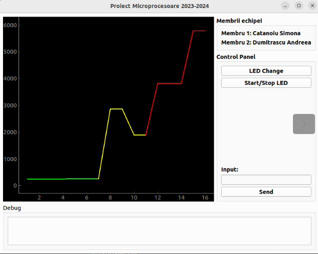
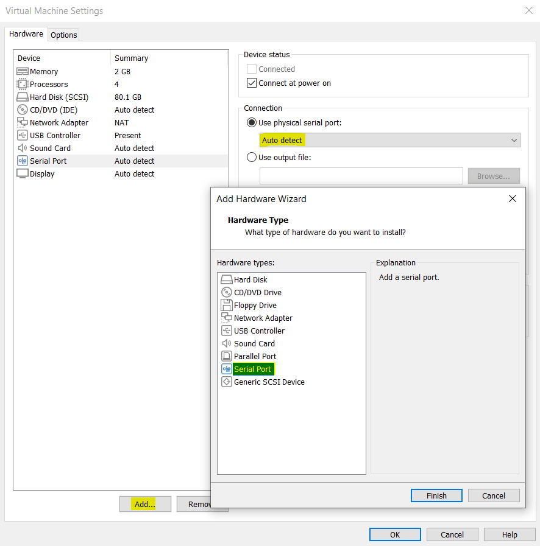
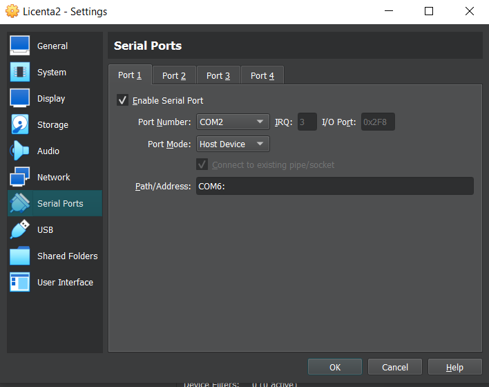

# Proiect Microprocesoare 2024

## Catanoiu Simona & Dumistrascu Andreea

Acest proiect reprezinta tema de laborator pentru cursul de Microprocesoare. Consta in folosirea placutei FRDM-KL25z pentru realizarea unui sistem capabil sa citeasca date de la un senzor de lumina ambientala si sa realizeze mutarea automata a elicei unui servomotor la 0,90 sau 180 de grade in functie de intervalul specific pentru datele captate de la senzor. De asemenea, foloseste modulul UART pentru transmiterea datelor catre o interfata dezvoltata in Python ce va permite reprezentarea grafica a datelor, precum si interactiunea cu microcontroller-ul (se vor putea modifica/aprinde/stinge led-urile de pe placuta).

In implementare au fost folosite urmatoarele module periferice:
- **UART** - comunicatie seriala asincrona
- **GPIO** - general purpose input/output, pentru lucrul cu LED-urile RGB on-board
- **PIT** - intreruperi la perioade specifice de timp
- **SYSTICK** - intreruperi la perioade specifice de timp
- **ADC** - achizitia datelor de la senzorul analogic
- **PWM** - controlul seromotorului

## Cerinte proiect:
- UART: Baud Rate 9600, OSR 32, MSB First ✅  
- GPIO: LED sequence - alb,verde,albastru,mov ✅ 
- ADC: Single ended precision - 16 ✅ 
- PIT: Led sequence Duration - 275ms ✅ 
- PWM: mutarea elicei la 0,90 sau 180 de grade in functie de datele trimise de la senzorul analog ✅ 
- Plotare grafic: verde pentru valori mici, galben pentru valori medii si rosu pentru valori mari ✅  

## Interfata


# Structura proiect git:
- ```src``` - proiectul de Keil
- ```doc``` - documentatia proiectului 
- ```gui``` - interfata de python

# Setup Proiect: 
Pentru rularea interfetei, detaliile se afla in folder-ul ```gui```.
Rularea interfetei se va face din masina virtuala, pentru care va fi configurat un port serial.
VMWare:



VirtualBox:



